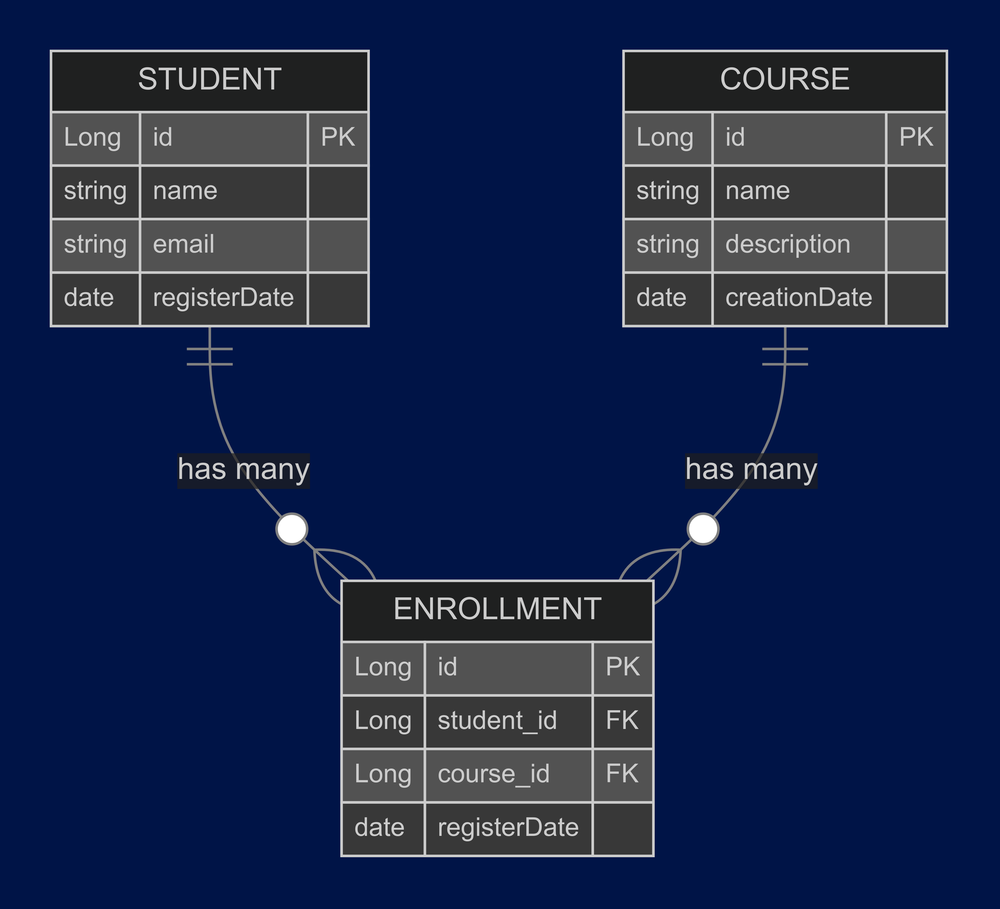

### **Online Courses API**



---

### **Descrição**
Uma aplicação Java para gerenciar uma plataforma de cursos online. Ela permite o cadastro de estudantes e cursos, além de gerenciar inscrições de estudantes em cursos.

---

### **Tecnologias e Dependências**

- **Linguagem:** Java 17
- **Frameworks:** Spring Boot 3.3.5
- **Banco de Dados:** H2 Database (em memória)
- **Bibliotecas:**
  - **Spring Web:** Para criação de APIs REST.
  - **Spring Data JPA:** Para ORM com Hibernate.
  - **Lombok:** Para redução de boilerplate no código.
- **Build Tool:** Maven
- **Plugins Maven:**
  - **Spring Boot Maven Plugin:** Para execução e empacotamento da aplicação.

---

### **Como Rodar a Aplicação**

1. **Clone o repositório:**
   ```bash
   git clone git@github.com:angelasoler/desafio-SAP-commerce.git
   cd desafio-SAP-commerce
   ```

2. **Compile e rode a aplicação:**
   ```bash
   mvn clean install
   mvn spring-boot:run
   ```

3. **Acesse a aplicação:**
   - Documentação da API: [http://localhost:8080/](http://localhost:8080/api/docs)
   - Teste a API utilizando qualquer ferramenta de requisição HTTP de sua preferência
---

### **Como Rodar os Testes**

Execute os testes usando o Maven:
```bash
mvn test
```

---

### **Exemplo de Comando `curl` para a Documentação**

**Comando:**
```bash
curl -X GET http://localhost:8080/api/docs -H "Accept: application/json"
```

**Exemplo de Resultado:**
```json
{
    "Welcome": "Welcome to the Online Courses API! Here are the available endpoints:",
    "Student Management": {
        "POST /students": "Register a new student. (Body: Student)"
    },
    "Course Management": {
        "POST /courses": "Register a new course. (Body: Course)"
    },
    "Enrollment Management": {
        "POST /enrollments": "Enroll a student in a course. (Params: studentId, courseId)",
        "GET /enrollments/coursesbyStudent/{studentId}": "List all courses for a specific student.",
        "GET /enrollments/studentsbyCourse/{courseId}": "List all students for a specific course."
    }
}
```

---

### **Diagrama Entidade-Relacionamento**


O diagrama acima representa o relacionamento entre estudantes, cursos e inscrições. Cada estudante pode se inscrever em vários cursos, e cada curso pode ter vários estudantes inscritos. A tabela `ENROLLMENT` modela a relação muitos-para-muitos entre `STUDENT` e `COURSE`.

--- 

